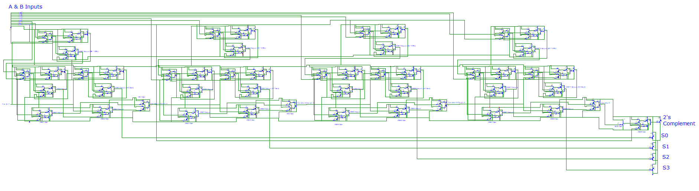

# 4-Bit Calculator (Transistor-Level Implementation)

## Overview

This project demonstrates the implementation of a 4-bit adder/subtractor built entirely from transistors and resistors to represent fundamental digital logic gates (AND, OR, NOT, XOR, NAND).  
The design highlights how complex digital systems such as adders can be constructed at the transistor level, without relying on prebuilt logic gate components.

## Video Demo
[](https://www.youtube.com/watch?v=T8PtresqV6k)


## Design Description

The circuit implements four cascaded 1-bit full adders, each composed of 2 XOR gates, 2 AND gates, and 1 OR gate. In total, the design is built using approximately 200 NPN transistors. This forms a complete 4-bit arithmetic circuit capable of performing both addition and subtraction of two 4-bit binary numbers.

## Design Highlights

- Implemented all logic gates using BJTs and resistors  
- Switch-based input system for A, B, and Add/Subtract mode  
- LED indicators used for outputs  

## Logic Gate-Level Schematic

This schematic shows the logic-level design of the 4-bit adder/subtractor before implementing it with discrete transistors. The circuit has a control input that determines the operation. When the control input is high the circuit performs subtraction (A − B) and when it is low it performs addition (A + B). The output LEDs show the result and if the 2’s complement LED is on the displayed answer is in 2’s complement. The circuit uses active-high logic and the signals A0, B0, and S0 are the least significant bits of the inputs and sum.


## Transistor-Level Schematic

Below is the transistor-level implementation of the full 4-bit adder/subtractor built using BJTs and resistors.




## Folder Structure
```markdwon
📁 4-Bit-Calculator/            # Root project folder
├── images/                     # Screenshots and schematic images
├── schematics/                 # Logic and transistor-level schematics
├── simulations/                # Simulation results for addition/subtraction tests
└── README.md                   # Project overview and documentation
```
